 

 

## 👋 Olá, eu sou o Luan

Técnico em Desenvolvimento de Sistemas que gosta de transformar ideia em coisa funcionando. Construo para **web** e **mobile**, sempre de olho em código limpo, interface agradável e aprendizado contínuo.

Aqui você encontra meus projetos, estudos e experimentos. Fique à vontade para explorar, abrir uma issue ou só dar uma estrela ⭐

 

## 🎓 Formação

- **Engenharia de Software**
- **Técnico em Desenvolvimento de Sistemas**

 

## 🛠️ Stack

 

## 🚀 Projetos

| Projeto | O que é | Tecnologia |
| :-- | :-- | :-- |
| [**🎯 mentalista**](https://github.com/LuanGomes99/mentalista) | Jogo de adivinhação: descubra o número secreto sorteado pelo sistema | `JavaScript` |
| [**💱 conversor-de-moedas**](https://github.com/LuanGomes99/conversor-de-moedas) | Conversor de moedas simples e direto ao ponto | `JavaScript` |
| [**✅ todolist-angular**](https://github.com/LuanGomes99/todolist-angular) | Lista de tarefas feita em Angular | `TypeScript` `Angular` |
| [**🏦 java-finance**](https://github.com/LuanGomes99/java-finance) | Sistema bancário no console: extrato, saldo, depósitos e saques em um menu interativo | `Java` |
| [**🌐 maonaroda-site**](https://github.com/LuanGomes99/maonaroda-site) | Site institucional | `HTML` `CSS` |

 

## 🌱 Em foco agora

- 🅰️ Praticando **Angular** e **TypeScript** em projetos de estudo
- ☕ Evoluindo na lógica e na orientação a objetos com **Java**
- 🎨 Caprichando em interfaces que sejam bonitas e fáceis de usar
- 🤝 Aberto a conversar sobre projetos, vagas e colaborações

 

## 🐍 Minha contribuição, em modo cobrinha

<picture>
  <source media="(prefers-color-scheme: dark)" srcset="https://raw.githubusercontent.com/LuanGomes99/LuanGomes99/output/github-contribution-grid-snake-dark.svg">
  <source media="(prefers-color-scheme: light)" srcset="https://raw.githubusercontent.com/LuanGomes99/LuanGomes99/output/github-contribution-grid-snake.svg">
  
</picture>

 

## 📊 Números

 

## 🎲 Um desafio rápido

Pensei em um número. Será que você acerta? Jogue o [**Mentalista**](https://github.com/LuanGomes99/mentalista) e me conte quantas tentativas levou.

 

Feito com ☕ e curiosidade em São Paulo.

